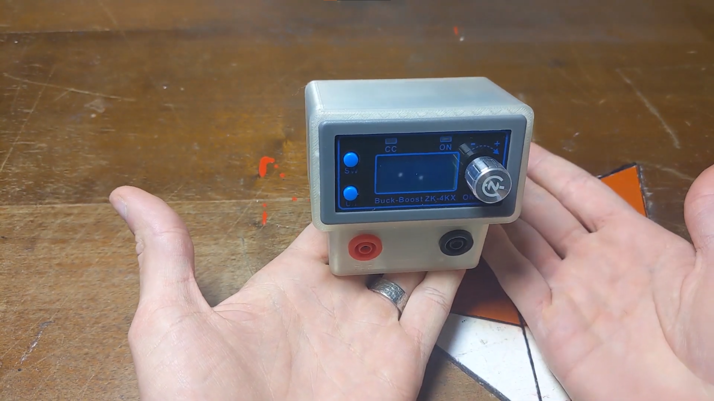
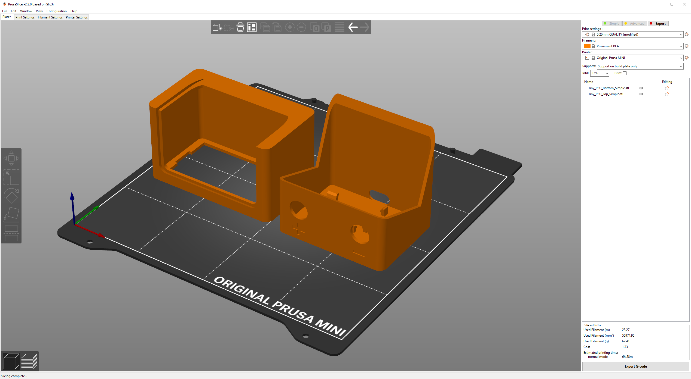

#  TinyPSU

A €12 portable bench power supply unit (USB C PD)

## Video
A short video about the process:

## Background
This project got started when Brian Lough released [this video](https://youtu.be/Xdq6dzH26QY) He build a simple USB-C Power Delivery bench power supply for just 12 dollar! in the video he shows all the components that you need and how it works (a must see)!

In the video he mentions some improvements of which one was the case design. I headed to the comments and got to work!

After a few designs I settles on a simple two part design that can easily be printed and clicked together.
I made a **BASIC** and **ADVANCED** version

## Basic Version
Basic version houses the same components as in Brian's video.
It takes 6 hour to print, a slight bit or support material needs to be removed and all components can be slit in place and wired.

## Advanced Version
The Advanced version contains the same components as the basic version but is screwed together and adds a fan to keep the module cool.

## Components
The components you need for this are the following:

| Component        | Price          | Link  |
| ------------- |-------------:| -----:|
| Variable buck boost converter      | €7.61 | [link](https://nl.aliexpress.com/item/4001078401775.html?aff_platform=shareComponent-detail&sk=_dY4CRkZ&aff_trace_key=8267c0fcad2d415295f246544766cafa-1602602738613-00803-_dY4CRkZ&terminal_id=ca670222cfd24fd6b840c6a4e340d4e2&tmLog=new_Detail) |
| PDC005 USB connector      | €1.44      |   [link](https://nl.aliexpress.com/item/4001253821461.html) |
| Banana socket | €1.28      |    [link](https://nl.aliexpress.com/item/4001315056705.html?spm=a2g0s.9042311.0.0.38514c4dVRb7Zd) |
| Fan(only for advanced) | €0.44      | [link](https://nl.aliexpress.com/item/32918866763.html?spm=a2g0o.productlist.0.0.62984d1bTmkGRT&algo_pvid=ec8d61d8-6df9-43c1-9d5f-755b474b6f4e&algo_expid=ec8d61d8-6df9-43c1-9d5f-755b474b6f4e-10&btsid=2100bdd016062512776757509e0fd5&ws_ab_test=searchweb0_0,searchweb201602_,searchweb201603_) |
| Buck converter for fan (only for advanced) | €0.25      | [link](https://nl.aliexpress.com/item/32725312642.html?spm=a2g0o.productlist.0.0.450d2e99xJFvii&algo_pvid=fd378764-7993-4095-8bde-07f42d1527b3&algo_expid=fd378764-7993-4095-8bde-07f42d1527b3-20&btsid=2100bdf016062513685307601e293e&ws_ab_test=searchweb0_0,searchweb201602_,searchweb201603_) |
| M3 4mm insert (2x) (only for advanced) | €0.25      | [link]() |
| M3 8mm bolt inbus (2x) (only for advanced) | €0.25      | [link]() |

## 3D models
all the 3D models and files are made in Fusion360 and can be found [here](https://a360.co/3dzU4cF)

I would recommend this print orentation, total print time on the Prusa Mini is about 6,5hour and can be printed with bed plate only support.

## Custom Front!
Since I was making this model truely mine I wanted to go the extra mile and also finish of front section of the screen
steps to reproduce this:
- lasercut front panel in clear 0.5mm plastic
- mask off sections that need to stay clear
- spray paint the back of the "screen"
- let it dry
- laser engrave away the spray paint.

## Future or To Do
- [ ] design can be made parametric so its easy to adjust to desired size
- [x] modules seem to be roughly the same front panel size so maybe other models would also fit? 

